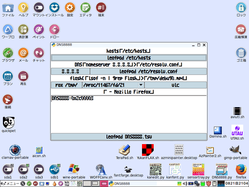

# 「DNS8888」はLinuxの「/etc/resolv.conf」に「Public DNS」を設定したりなどするツールのPythonによる実装です。

## DNSは取扱い注意。だけど万が一に備えて取扱う方法は知っておくべき。

プロバイダーから普通に付与されてるDNSは必ず控えを確保してください。通常ははプロバイダーから付与されるDNSを使うはずです。  
変なコピペの魔法の数字とかいうフレーズに騙されてPrivate DNSに繋がないよう気を付けてください。  
逆に全てのPublic DNSが善意で公開されてると都合のいい解釈もしないでください。  
更にGoogleのPublic DNS&#40;8.8.8.8&#41;ですらたまにハッキング&#40;ハイジャック&#41;されるニュースとかあるのでアンテナは張ってください。  
DNSの変更はいわゆる自己責任なので万が一危険なサイトに釣られても謝罪賠償誠意便宜の類は致しません。

## 操作方法。

  

「8.8.8.8」ボタンを押すと「/etc/resolv.conf」に「8.8.8.8」「8.8.4.4」が追加される。  
ダイアルアップの度に「/etc/resolv.conf」は初期化されるのでその度にDNSの確認。  
[DNS8888.tsv](DNS8888.tsv)にはGoogle以外のDNSもコメントアウトの形で併記してますが無保証です。  

## おまけ機能。

* 「/etc/hosts」の確認・編集。
* ブラウザ上のFLVやMP4の再生を試みる実験。
* 「Mozilla Firefox」のタイトル取得・文字列置換。  

## 「LTsv」フォルダについて。

「LTsv」フォルダ内の「L&#58;Tsv」モジュールのドキュメント等は「[LTsv10kanedit](https://github.com/ooblog/LTsv10kanedit "LTsv10kanedit")」で入手。  
「DNS8888」では「LTsv/kanchar.tsv」など漢直の辞書ファイルなどが省略されてます。  

## 動作環境。

Python2.7.3&#40;PuppyLinux571JP&#41;およびPython3.4.3&#40;Wine1.7.18&#41;で動作を確認しています。  
Windowsでは起動はすれど動作しません&#40;Linux用&#41;。  
特にWindowsの場合市販のセキュリティソフトが「c:¥windows¥system32¥drivers¥etc¥hosts」の編集をガードするはずです。

## ライセンス・著作権など。

Copyright (c) 2016 ooblog  
License: MIT  
[https://github.com/ooblog/DNS8888/blob/master/LICENSE](https://github.com/ooblog/DNS8888/blob/master/LICENSE "https://github.com/ooblog/DNS8888/blob/master/LICENSE")  
